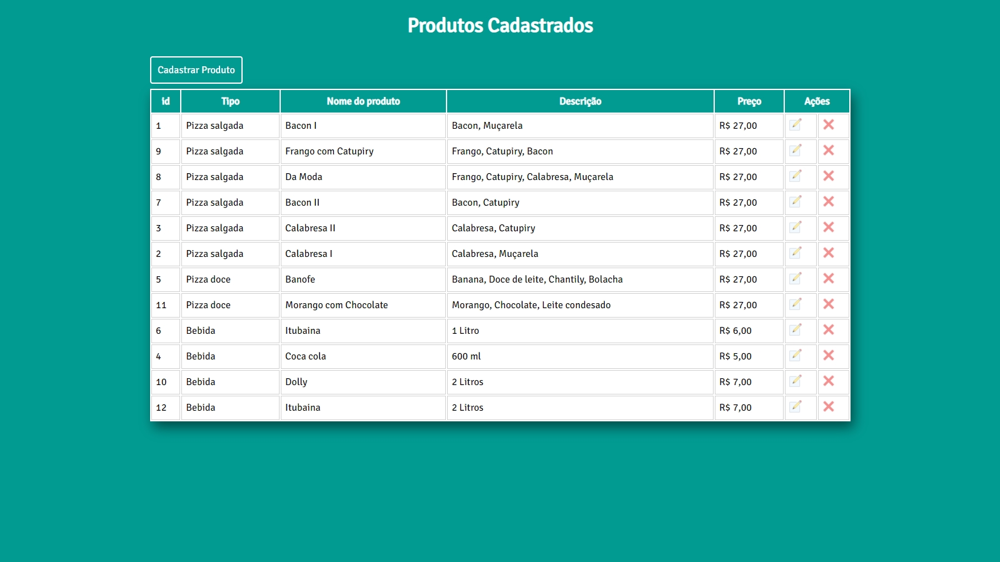

# Java EE - CRUD - MVC

O projeto mostra as quatro operações do CRUD com produtos, utilizando o padrão de projetos MVC

> :heavy_check_mark: Status do Projeto: Concluido, aguardando imprementações

